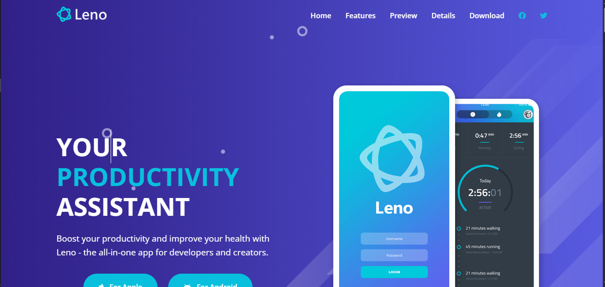

# 🧠 Leno App – Health & Productivity

A modern **landing page** for a health and productivity mobile application called **Leno**.  
Built with **HTML5, CSS3, and JavaScript**, this responsive website highlights app features, testimonials, pricing plans, and download options in a sleek, user-friendly layout.

---

## 🚀 Live Demo (Vercel)
👉  [View Live on Vercel](https://leno-app-delta.vercel.app/)  

---

## 📸 Preview  


---

## 🧩 Features  

- ✅ **Fully Responsive Design** — optimized for all devices (mobile, tablet, desktop).  
- ⚡ **Modern Layout** — clean, minimal, and product-focused interface.  
- 🧘 **Health & Productivity Focus** — app details, testimonials, and download sections.  
- 🧱 **Reusable Components** — structured with reusable class naming conventions (BEM).  
- 🎥 **Video Preview Modal** — preview feature included for interactive experience.  
- 💰 **Pricing Page** — detailed comparison with different plans.  
- 📱 **Mobile Navigation Menu** — toggled hamburger menu for smaller screens.  

---

## 🗂️ Project Structure  

```
Leno-App/
│
├── index.html               # Main landing page
├── details.html             # Pricing & detailed features page
│
├── css/
│   └── styles.css           # Main stylesheet
│
├── js/
│   └── script.js            # JavaScript for interactivity
│
├── images/
│   └── homepage.png         # Homepage screenshot (replace with your image)
│
└── README.md                # Documentation
```

---

## 🛠️ Built With  

| Technology | Purpose |
|-------------|----------|
| **HTML5** | Structure and content |
| **CSS3** | Styling and layout |
| **Font Awesome** | Icons |
| **Google Fonts (Open Sans)** | Typography |
| **Vanilla JavaScript (ES6)** | Mobile navigation & modal functionality |

---

## 🧮 How to Run Locally  

1. Clone this repository:
   ```bash
   git clone https://github.com/UmarKhan-codeer/Leno-App.git
   ```
2. Open the folder:
   ```bash
   cd Leno-App
   ```
3. Open `index.html` in your browser:
   ```bash
   start index.html
   ```
   *(or simply double-click it)*

---

## 🧑‍💻 Author  

**Umar Khan**  
💼 Front-End Developer  
📧 [your-email@example.com](mailto:your-email@example.com)  
🌐 [Portfolio Link](#https://portfolio-umer-pro.vercel.app/)

---

## 📄 License  
This project is licensed under the **MIT License** – feel free to use and modify it.

---

## ⭐ Acknowledgments  

- Inspired by modern SaaS app landing page designs.  
- Icons by [Font Awesome](https://fontawesome.com/).  
- Fonts by [Google Fonts](https://fonts.google.com/).  
